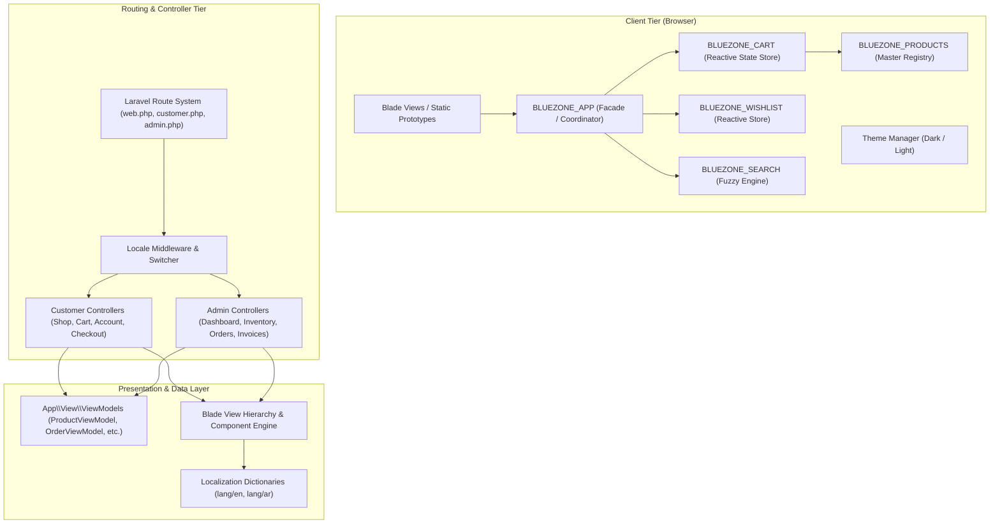

# BLUE ZONE™ — System Architecture, Design Patterns & File Structure Report

Welcome to the technical architecture report for the **BLUE ZONE Longevity & Cellular Health** web application. This document details the architectural paradigms, software design patterns (frontend and backend), directory taxonomy, data flows, and engineering best practices utilized throughout the platform.

---

## 1. Executive Architectural Overview

The **BLUE ZONE™** application is engineered as a **hybrid e-commerce & longevity health platform** that combines:

1. **Server-Side Rendered (SSR) Laravel 12 Backend**: Clean separation of concerns with dedicated Customer and Admin ERP domains, powered by the **ViewModel / Presenter Pattern** and reusable **Blade Component Architecture**.
2. **Client-Side Reactive Vanilla JS Engine**: A zero-dependency, ultra-fast client state layer using the **Revealing Module Pattern**, **Mediator/Facade Pattern**, **Observer/Pub-Sub Sync**, and **Self-Healing LocalStorage Hydration**.
3. **Multi-Locale (i18n) & RTL/LTR Mirroring**: Native bilingual support (English & Arabic) across both storefront and administrative consoles.



---

## 2. Directory Taxonomy & File Structure Breakdown

Below is the complete file organization map of the project, annotated with the responsibility of each folder and file:

```
Blue_Zone_site/
├── app/                                  # Core PHP Application Code
│   ├── Http/
│   │   └── Controllers/
│   │       ├── Controller.php            # Base Laravel Controller
│   │       ├── Customer/                 # Storefront & Customer Controllers
│   │       │   ├── AccountController.php # Customer portal (profile, orders, addresses)
│   │       │   ├── AuthController.php    # Login, register, password recovery
│   │       │   ├── CartController.php    # Cart view rendering
│   │       │   ├── CheckoutController.php# Multi-step checkout pipeline
│   │       │   ├── HomeController.php    # Flagship homepage controller
│   │       │   ├── PageController.php    # Content pages (Science, Team, Blog, Contact)
│   │       │   ├── ProductController.php # Single product details & clinical dossiers
│   │       │   └── ShopController.php    # Catalog filtering, sorting & search
│   │       └── Admin/                    # Back-Office ERP & Admin Controllers
│   │           ├── CategoryController.php# Taxonomy & category management
│   │           ├── ContentController.php # CMS / landing page section editor
│   │           ├── CustomerController.php# CRM / Customer relationship manager
│   │           ├── DashboardController.php# Metric KPIs, analytics, overview
│   │           ├── InventoryController.php# Stock levels, movements, low-stock alerts
│   │           ├── InvoiceController.php  # Billing & invoice generation
│   │           ├── OfflineSaleController.php# POS / Offline retail transactions
│   │           ├── OrderController.php    # Order fulfillment & status workflow
│   │           ├── ProductController.php  # SKU catalog CRUD & dosage matrices
│   │           ├── ReportController.php   # Revenue, stock, sales reporting
│   │           ├── RoleController.php     # RBAC roles & permissions
│   │           ├── SettingController.php  # Store & system settings
│   │           └── UserController.php     # Admin staff user management
│   ├── Models/
│   │   └── User.php                      # User domain model
│   ├── Providers/
│   │   ├── AppServiceProvider.php        # Application service bootstrap
│   │   └── Filament/                     # Filament Admin Panel service provider
│   └── View/
│       └── ViewModels/                   # ViewModels (Domain-to-View Presenters)
│           ├── CategoryViewModel.php     # Category taxonomies & icons
│           ├── ContentViewModel.php      # Hero slides, zones, testimonials, FAQs
│           ├── CustomerViewModel.php     # Customer accounts & analytics mock
│           ├── InventoryViewModel.php    # Warehouse stock & movements
│           ├── OrderViewModel.php        # Orders, line items & shipping timeline
│           ├── ProductViewModel.php      # Master product catalog & clinical formulas
│           ├── ReportViewModel.php       # KPI calculation & revenue charts
│           ├── RoleViewModel.php         # Permission matrices
│           ├── SettingViewModel.php      # Localization, tax & currency settings
│           └── UserViewModel.php         # Admin staff profiles & statuses
│
├── bootstrap/                            # Laravel bootstrap & application initialization
│   ├── app.php                           # Application configuration & middleware bindings
│   └── providers.php                     # Provider registrations
│
├── config/                               # Laravel system configuration files (app, database, etc.)
│
├── components/                           # Client-side Static HTML Partial Components
│   ├── header.html                       # Global navigation bar component
│   ├── footer.html                       # Global footer & newsletter subscription
│   ├── cart-drawer.html                  # Offcanvas cart sliding drawer
│   ├── wishlist-drawer.html              # Offcanvas wishlist drawer
│   └── search-overlay.html               # Instant search overlay modal
│
├── css/                                  # Styling Assets & Design System
│   ├── custom.css                        # Glassmorphism, animations, tokens, scrollbar
│   └── map-loader.css                    # World map interactive preloader animation
│
├── database/                             # Database migrations, seeders, factories
│   ├── factories/
│   ├── migrations/
│   └── seeders/
│
├── js/                                   # Client-side Reactive JavaScript Modules
│   ├── app.js                            # BLUEZONE_APP: Coordinator, toasts, modals, quiz
│   ├── cart.js                           # BLUEZONE_CART: Cart store, upsells, discount codes
│   ├── wishlist.js                       # BLUEZONE_WISHLIST: Reactive wishlist manager
│   ├── products.js                       # BLUEZONE_PRODUCTS: Single source of truth data matrix
│   ├── search.js                         # BLUEZONE_SEARCH: Fuzzy search algorithm & index
│   ├── theme.js                          # Theme switcher (Dark / Light / LocalStorage)
│   ├── hero-slider.js                    # Hero carousel and animation controller
│   ├── product-slider.js                 # Touch-enabled responsive product card carousel
│   └── map.js                            # Interactive Blue Zone geographical explorer
│
├── lang/                                 # Localization (i18n) Translation Dictionaries
│   ├── en/                               # English translations
│   │   ├── admin.php                     # Admin ERP strings
│   │   ├── app.php                       # Storefront navigation, footer, generic strings
│   │   └── shop.php                      # Catalog, product attributes, cart strings
│   └── ar/                               # Arabic translations (RTL optimized)
│       ├── admin.php                     # Arabic Admin strings
│       ├── app.php                       # Arabic Storefront strings
│       └── shop.php                      # Arabic Catalog strings
│
├── lazy_html/                            # Static HTML Prototypes (Mirrored for standalone preview)
│   ├── index.html, shop.html, product.html, science.html, team.html, blog.html, contact.html
│
├── public/                               # Public HTTP Web Root
│   ├── index.php                         # Laravel Entry Point (Front Controller)
│   └── assets/                           # Media, logos, and product graphics
│
├── resources/                            # Blade Views & Build Assets
│   ├── views/
│   │   ├── layouts/
│   │   │   ├── customer.blade.php        # Customer layout (Nav, Cart, Wishlist, Footer)
│   │   │   ├── admin.blade.php           # Admin layout (Sidebar, Topbar, RTL support)
│   │   │   ├── auth.blade.php            # Dedicated authentication layout
│   │   │   └── app.blade.php             # Generic base application layout
│   │   ├── customer/                     # Customer Storefront Views
│   │   │   ├── home/index.blade.php      # Main homepage
│   │   │   ├── shop/index.blade.php      # Catalog with instant filters
│   │   │   ├── products/show.blade.php   # Dynamic product detail page
│   │   │   ├── cart/index.blade.php      # Full cart page
│   │   │   ├── checkout/index.blade.php  # Multi-step checkout
│   │   │   ├── account/                  # Dashboard, orders, profile, invoices
│   │   │   ├── auth/                     # Login, register, password recovery
│   │   │   └── pages/                    # Science, Team, Blog, Contact, FAQs
│   │   ├── admin/                        # Admin ERP Views
│   │   │   ├── dashboard/                # Analytics KPIs & metric widgets
│   │   │   ├── products/                 # SKU catalog table, forms, dosage matrices
│   │   │   ├── inventory/                # Stock balances & movement logs
│   │   │   ├── orders/                   # Order tracking & processing
│   │   │   ├── invoices/                 # Invoicing & PDF-ready printable views
│   │   │   ├── offline-sales/            # POS register interface
│   │   │   ├── customers/                # Customer directory & histories
│   │   │   ├── categories/               # Category taxonomy tree
│   │   │   ├── content/                  # CMS content section management
│   │   │   ├── reports/                  # Sales & inventory graphs
│   │   │   ├── roles/                    # Role management
│   │   │   ├── users/                    # User accounts
│   │   │   └── settings/                 # Store settings
│   │   └── components/                   # Reusable Blade Component Library
│   │       ├── product-card.blade.php    # Standardized product card
│   │       ├── status-badge.blade.php    # Order/stock status chip
│   │       ├── empty-state.blade.php     # Zero-data feedback placeholder
│   │       ├── confirmation-modal.blade.php # Action confirmation dialog
│   │       ├── pagination.blade.php      # Table pagination bar
│   │       ├── buttons/                  # Primary, secondary, icon buttons
│   │       ├── cards/                    # KPI cards, statistic widgets
│   │       ├── forms/                    # Text inputs, selects, toggles
│   │       ├── modals/                   # Quick-view, compare dialogs
│   │       ├── navigation/               # Breadcrumbs, tabs, page headers
│   │       └── tables/                   # Responsive data tables
│
├── routes/                               # Route Declarations
│   ├── web.php                           # Master route loader & locale switch handler
│   ├── customer.php                      # Storefront route definitions
│   ├── admin.php                         # Admin route definitions
│   └── console.php                       # Artisan CLI commands
│
└── tests/                                # Unit and Feature Test Suites
```

---

## 3. Design Patterns Used in the System

### A. Backend Design Patterns (PHP / Laravel)

| Design Pattern | Where It Is Used | Implementation & Purpose |
| :--- | :--- | :--- |
| **Model-View-Controller (MVC)** | `app/Http/Controllers/`, `resources/views/` | Separates HTTP request handling (`Customer Controllers`, `Admin Controllers`) from business/presentation logic and Blade views. |
| **ViewModel / Presenter Pattern** | `app/View/ViewModels/` (`ProductViewModel`, `OrderViewModel`, `ReportViewModel`, etc.) | Encapsulates data transformation, calculations, and catalog registries away from controllers. Keeps controllers concise and declarative. |
| **Front Controller Pattern** | `public/index.php` | Central entry point that initializes the Laravel framework, runs middleware, and dispatches HTTP requests. |
| **Composite / Component Pattern** | `resources/views/components/` | UI built from reusable atomic Blade components (`<x-product-card>`, `<x-status-badge>`, `<x-empty-state>`, `<x-buttons.*>`, `<x-forms.*>`). |
| **Template Method / Layout Inheritance** | `resources/views/layouts/` (`customer.blade.php`, `admin.blade.php`) | Master layouts define structural boilerplate (meta, scripts, navigation, modals, toasts), while child views fill designated slots and sections. |
| **Modular Route Splitting** | `routes/web.php`, `routes/customer.php`, `routes/admin.php` | Separates customer storefront and admin ERP endpoints into dedicated namespaces (`customer.*` and `admin.*`). |
| **Internationalization (i18n Strategy)** | `lang/en/`, `lang/ar/`, `routes/web.php` | Session-based strategy for dynamic bilingual rendering (`app()->getLocale()`) supporting English (LTR) and Arabic (RTL) with localized attribute pairs (`name_en`/`name_ar`). |

---

### B. Frontend Design Patterns (JavaScript & Client State)

| Design Pattern | Where It Is Used | Implementation & Purpose |
| :--- | :--- | :--- |
| **Revealing Module Pattern (IIFE)** | `js/cart.js`, `js/wishlist.js`, `js/search.js`, `js/app.js` | Uses Immediately Invoked Function Expressions to encapsulate private variables and expose clean public interfaces to `window` (e.g., `window.BLUEZONE_CART = { get, add, remove, ... }`). |
| **Facade / Mediator Pattern** | `js/app.js` (`BLUEZONE_APP`) | Single global coordinator handling UI toast queues (`showToast`), scroll locking (`lockBodyScroll`), compare modal (`openCompare`), quiz dialog (`openQuiz`), and keyboard shortcuts. |
| **Observer / Pub-Sub (Badge Synchronizer)** | `js/cart.js`, `js/wishlist.js` | State modifications in `saveCart()` notify all subscriber DOM elements (`.cart-badge-count`, `.wishlist-badge-count`) and trigger pop animations. |
| **Single Source of Truth / Master Registry** | `js/products.js` (`window.BLUEZONE_PRODUCTS`) | Central in-memory registry containing standardized product models, clinical dosage matrices, and taxonomy data used across all client modules. |
| **Self-Healing State Hydration** | `js/cart.js` | Validates `localStorage` items upon load. If corrupted or outdated, it repairs items using the master catalog registry. |
| **Strategy Pattern (Discounts & Promo Codes)** | `js/cart.js` | Calculation strategies for promo codes (`LONGEVITY10`, `BLUEZONE20`, `WELCOME15`), free shipping thresholds ($75.00), and subscription discounts (15%). |
| **Strategy Pattern (Search & Filtering)** | `js/search.js` | In-memory fuzzy search engine matching across product names, categories, tags, short descriptions, and clinical active ingredients. |
| **Carousel / Touch Slider Pattern** | `js/hero-slider.js`, `js/product-slider.js` | Encapsulates touch/swipe physics, auto-play timers, and active indicator dot synchronization. |
| **Intersection Observer (Lazy/Scroll Reveal)** | `js/app.js` | Hardware-accelerated viewport detection triggering CSS reveal animations as cards scroll into view without scroll-listener overhead. |

---

## 4. Key End-to-End System Workflows

### 1. The E-Commerce Cart & Drawer Lifecycle
```
User clicks "Add to Cart" 
  │
  ▼
BLUEZONE_CART.add(productId, qty)
  │──> Finds product in BLUEZONE_PRODUCTS (Master Registry)
  │──> Updates items array & persists to localStorage
  │──> Triggers updateCartBadge() (Observer update with pop animation)
  │──> Triggers renderCartDrawer() (Recalculates subtotal, shipping bar, & upsell pairings)
  │──> Calls BLUEZONE_APP.showToast() (Queues visual feedback)
  ▼
Cart Drawer slides in via CSS transform
```

### 2. Multi-Language & RTL Layout Flow
```
User clicks language toggle (e.g., Arabic 'العربية')
  │
  ▼
GET /lang/ar (Handled in routes/web.php)
  │──> Validates locale is 'en' or 'ar'
  │──> Sets session(['locale' => 'ar'])
  │──> Redirects back to previous URL
  ▼
Layout Blade Template (layouts/customer.blade.php or layouts/admin.blade.php)
  │──> Checks app()->getLocale() === 'ar'
  │──> Sets <html lang="ar" dir="rtl">
  │──> Applies RTL layout classes (flips sidebars, padding, chevron directions)
  │──> Translates all UI strings using __('app.xxx') and ViewModel fields (name_ar)
```

---

## 5. Architectural Strengths & Summary

1. **Zero External Frontend Dependencies**: Pure Vanilla JS ensures maximum performance, zero bundle overhead, and rock-solid stability.
2. **ViewModel Separation**: Keeps controllers clean and focused on routing, delegating data transformation and mock registries to dedicated ViewModels.
3. **Atomic Component Hierarchy**: Blade components provide high reusability across both Customer storefront and Admin back-office panels.
4. **Accessible & Responsive**: Fully equipped with ARIA tags, structured JSON-LD MedicalBusiness schema, and responsive mobile touch navigation docks.
