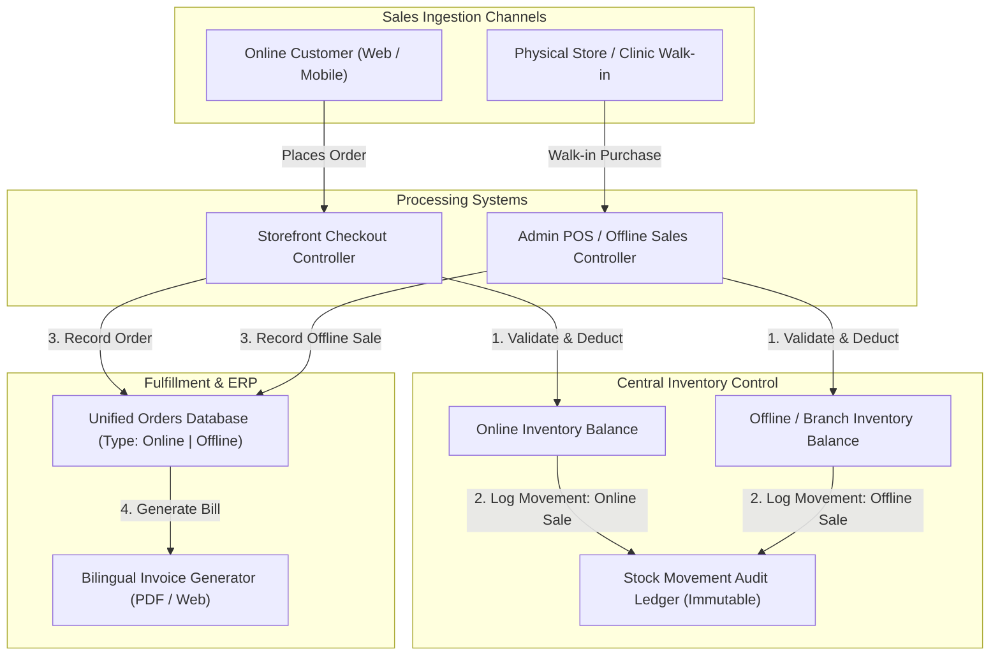
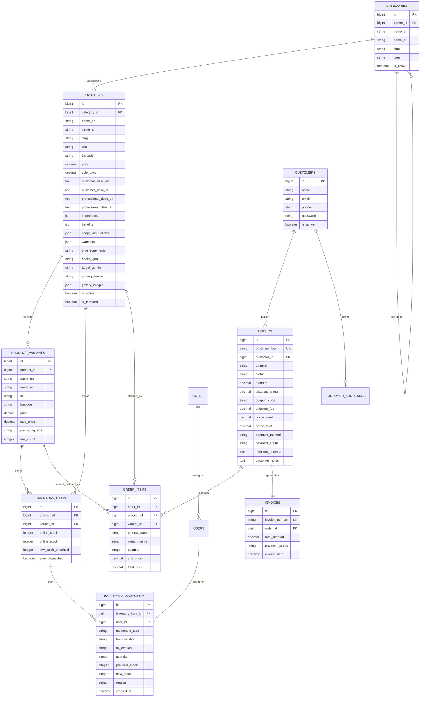

# BLUE ZONE™ — Complete System Requirements & Technical Specification

> **Document Type:** Full Business, Technical & Architectural Requirements Specification  
> **Platform:** BLUE ZONE Health & Longevity E-Commerce Platform & ERP  
> **Stack:** Laravel 12 (PHP 8.2+), Filament 3 Admin Panel, Tailwind CSS / Vanilla CSS, Blade Component Architecture, MySQL  
> **Status:** Approved Baseline Specification for Implementation  

---

## Table of Contents

1. [Executive Summary & Project Overview](#1-executive-summary--project-overview)
2. [Brand Concept, Aesthetics & UI/UX Guidelines](#2-brand-concept-aesthetics--uiux-guidelines)
3. [Multi-Channel Architecture (Online & Offline Sales)](#3-multi-channel-architecture-online--offline-sales)
4. [Bilingual System & RTL/LTR Strategy (i18n)](#4-bilingual-system--rtlltr-strategy-i18n)
5. [Theme Engine (Light Mode & Dark Mode)](#5-theme-engine-light-mode--dark-mode)
6. [Customer Storefront Specifications](#6-customer-storefront-specifications)
   - 6.1 Homepage Experience
   - 6.2 Product Catalog, Taxonomies & Dynamic Filtering
   - 6.3 Product Detail Page & Dual Descriptions (Consumer vs. Professional)
   - 6.4 Shopping Cart & Validation Logic
   - 6.5 Checkout Pipeline & Payment Processing
   - 6.6 Customer Account Portal & Self-Service
7. [Centralized Dual-Stock Inventory System](#7-centralized-dual-stock-inventory-system)
   - 7.1 Location/Channel Stock Separation (Online vs. Offline)
   - 7.2 Stock Transfers & Movement Recording
   - 7.3 Movement Types & Audit Trails
   - 7.4 Low Stock Thresholds & Out-of-Stock Automations
8. [Order Management & Invoicing System](#8-order-management--invoicing-system)
   - 8.1 Online Order Lifecycle
   - 8.2 Offline / POS Sales Flow
   - 8.3 Order Status Matrix & State Transitions
   - 8.4 Invoicing Pipeline (Web, PDF, Print)
9. [Admin Dashboard & Back-Office ERP (Filament 3)](#9-admin-dashboard--back-office-erp-filament-3)
   - 9.1 Metric KPIs & Analytics
   - 9.2 Product & Taxonomy Management
   - 9.3 Content Management System (CMS)
   - 9.4 Role-Based Access Control (RBAC)
   - 9.5 Reporting Suite (Sales, Inventory, Customers)
   - 9.6 Notification Engine
10. [The 10 Golden Business Rules](#10-the-10-golden-business-rules)
11. [Database Schema & Entity Relationship Model](#11-database-schema--entity-relationship-model)
12. [Future Scalability & Modular Expansion Roadmap](#12-future-scalability--modular-expansion-roadmap)

---

## 1. Executive Summary & Project Overview

The **BLUE ZONE™** platform is an enterprise-grade **Health & Wellness E-Commerce Platform and Inventory ERP** engineered for the formulation, distribution, and direct-to-consumer sales of premium longevity supplements, vitamins, botanical extracts, and healthy lifestyle protocols.

### Key Operational Capabilities
* **Dual-Channel Unified Commerce:**
  * **Online Storefront:** High-converting direct-to-consumer digital shopping experience.
  * **Offline / Branch Sales:** Dedicated POS & manual retail sales processing interface.
* **Centralized Dual-Stock Inventory:** Shared multi-location inventory database maintaining isolated **Online Stock** and **Offline Stock** balances per SKU/variant with real-time transfer and audit recording.
* **Enterprise Scalability:** Modular architecture allowing future expansion into multi-warehouse distribution, B2B clinical ordering, batch/lot tracking, barcode workflows, and subscription models without re-architecting the core database.

---

## 2. Brand Concept, Aesthetics & UI/UX Guidelines

The brand identity is derived from the **5 Global Blue Zones** (Okinawa, Sardinia, Nicoya, Ikaria, Loma Linda)—regions recognized for exceptional human longevity, cellular vitality, and natural lifestyles.

```
┌───────────────────────────────────────────────────────────────────────────┐
│                           BRAND IDENTITY PILLARS                          │
├─────────────────┬─────────────────┬───────────────────┬───────────────────┤
│ Healthy Living  │    Longevity    │  Clinical Science │  Trust & Vitality │
└─────────────────┴─────────────────┴───────────────────┴───────────────────┘
```

### UI/UX Imperatives
* **Not a Traditional Pharmacy:** Must feel like an **ultra-premium, science-backed longevity and wellness brand** (clean aesthetics, rich typography, smooth transitions, glassmorphic cards).
* **Responsive Multi-Device Layout:** Mobile-First design fully responsive across mobile phones, tablets, laptops, and ultra-wide desktops.
* **Modern Typography:** Primary font family: `Cairo` (Google Fonts) with full bilingual geometric glyph balance.
* **Color Palette Tokens:**
  * `Deep Navy (#031827)` — Primary luxury dark background & text.
  * `Dark Navy (#062B49)` — Elevated card surfaces in dark mode.
  * `Ocean Blue (#0A4F78)` — Core brand anchor & primary action buttons.
  * `Accent Blue (#2A8FC2)` — Interactive hover states & clinical highlights.
  * `Natural Green (#67B34A)` — Vitality accents, success badges & active tabs.
  * `Off-White (#F6F5EF)` — Warm editorial default background in light mode.
  * `Warm Sand (#E8DCC4)` — Muted gold accents and secondary text.

---

## 3. Multi-Channel Architecture (Online & Offline Sales)



---

## 4. Bilingual System & RTL/LTR Strategy (i18n)

The platform supports first-class **Arabic (AR)** and **English (EN)** localization across both Customer Storefront and Admin ERP.

### Translation & Content Scope
All content is managed through bilingual paired fields in the database and translation dictionaries:
* **Product Catalog:** `name_en` / `name_ar`, `slug_en` / `slug_ar`, `short_desc_en` / `short_desc_ar`.
* **Descriptions:** `customer_desc_en` / `customer_desc_ar`, `professional_desc_en` / `professional_desc_ar`.
* **Clinical Properties:** `ingredients_en` / `ingredients_ar`, `benefits_en` / `benefits_ar`, `usage_en` / `usage_ar`, `warnings_en` / `warnings_ar`.
* **Taxonomies & CMS:** Category titles, banner headlines, story blurbs, footer links, and validation error messages.

### Direction & Layout Mirroring
* **English:** `dir="ltr"` with standard left-to-right flex/grid orientation.
* **Arabic:** `dir="rtl"` with mirrored sidebars, inverted pagination chevrons, right-aligned form labels, and appropriate letter-spacing.
* **Locale Switcher:** Instant switcher available in storefront top bar and admin profile without resetting form states.

---

## 5. Theme Engine (Light Mode & Dark Mode)

* **Default Theme:** **Light Mode** is the strict default across all first-time visits and unauthenticated users.
* **Dark Mode:** Deep oceanic dark theme activated via persistent client toggle.
* **Zero Flash of Unstyled Content (FOUC):** Head-inlined immediate execution script reads `localStorage('bluezone_theme')` and assigns `.dark` class to `<html>` before initial paint.
* **Complete System Parity:** Full contrast compliance across storefront cards, modals, tables, Filament form inputs, and checkout screens.

---

## 6. Customer Storefront Specifications

### 6.1 Homepage Experience
* **Hero Carousel:** Multi-slide visual storytelling with scientific longevity messaging and direct CTAs.
* **Longevity Pillars Orbital Section:** Interactive 6-node SVG animation displaying the core pillars of longevity (Movement, Nutrition, Purpose, Community, Rest, Cellular Wellness).
* **Five Blue Zones Showcase:** Interactive visual explorer for Okinawa, Sardinia, Nicoya, Ikaria, and Loma Linda with smooth image transitions, active marker tags, and cultural habits.
* **Featured Formulations Carousel:** Touch-enabled product slider with rating badges, quick add-to-cart, and direct product links.
* **Our Science 4-Stage Journey:** Interactive timeline (Source → Formulation → Validation → Wellness).
* **Research Journal / Whitepapers:** Educational articles written by scientific advisors.

### 6.2 Product Catalog & Dynamic Filtering
* **Dynamic Categories & Subcategories:** Database-driven taxonomy navigation (Vitamins, Multivitamins, Minerals, Longevity Supplements, Healthy Lifestyle, Sports Nutrition).
* **Filtering Dimensions:**
  * Category / Subcategory
  * Target Health Goal (Cognition, Cellular Energy, Sleep, Immunity, Joint Mobility, Cardio)
  * Target Audience / Gender (All, Men, Women)
  * Price Range Slider
  * Availability (In Stock / Out of Stock)
* **Sorting Options:** Featured, Newest Arrivals, Price (Low to High), Price (High to Low), Highest Rated.

### 6.3 Dual Product Descriptions (Consumer vs. Professional)
To serve both direct consumers and medical practitioners/specialists, every product maintains two separate presentation layers:

| Layer | Target Audience | Content Elements |
| :--- | :--- | :--- |
| **Consumer View (Default)** | Everyday Customers | Simple explanation, primary benefits, how-to-use, who it's for, key safety warnings. |
| **Professional Clinical Dossier** | Doctors, Pharmacists, Nutritionists | Full active formula, concentration & standardized extracts (e.g. 95% Curcuminoids), bio-availability mechanisms, contraindications, clinical references. |

> *Rule: The professional clinical content must be encapsulated in a dedicated expandable tab/dossier to maintain a clean shopping interface for general consumers.*

### 6.4 Shopping Cart & Validation Logic
* **Reactive Offcanvas Cart Drawer:** Instant item addition with dynamic subtotal recalculation, free shipping progress bar, and smart upsell pairings.
* **Server-Side Stock Validation:** Real-time check against `online_stock` before proceeding to checkout.
* **Quantity Restrictions:** Prevents selecting quantities exceeding current available online inventory.
* **Coupon & Promo Engine:** Real-time promo code validation (e.g. `LONGEVITY10`) deducting percentage or fixed amounts.

### 6.5 Checkout Pipeline & Payment Processing
* **Customer Information Gathering:**
  * Full Name, Mobile Phone Number, Email Address.
  * Shipping Address, City, Postal Zone, Optional Delivery Notes.
* **Order Review:**
  * Line items with selected variants and thumbnail previews.
  * Subtotal, Coupon Discount, Estimated Shipping, Estimated Tax, Final Grand Total.
* **Supported Payment Methods:**
  * **Online Payment Gateway:** Credit/Debit Cards, Apple Pay, Local Payment Gateways.
  * **Cash on Delivery (COD):** Offline payment upon physical receipt.
* **Order Processing Execution:**
  1. Verifies item availability in `online_stock`.
  2. Generates unique order reference (`BZ-YYYYMM-XXXX`).
  3. Inserts `orders` record (`status = 'pending'`).
  4. Inserts `order_items` records.
  5. Deducts purchased quantity from `inventory_items.online_stock`.
  6. Creates immutable `inventory_movements` record (`movement_type = 'online_sale'`).
  7. Clears customer cart and redirects to Order Confirmation Page with printable receipt.

### 6.6 Customer Account Portal
* **Dashboard Overview:** Recent orders, default delivery address, account settings.
* **Order History & Live Status Tracking:**
  * Real-time order progress badge (`Pending` → `Confirmed` → `Processing` → `Shipped` → `Delivered`).
  * Itemized line breakdown with re-order shortcuts.
* **Invoice Download Center:** Access, download, and print official PDF tax invoices.
* **Address Book:** Multi-address management (Home, Office, Clinic) with default assignment.
* **Profile Settings:** Update personal info, phone, email, and password.

---

## 7. Centralized Dual-Stock Inventory System

### 7.1 Location/Channel Stock Separation
Every SKU and product variant has an inventory record maintaining two distinct stock counts:
$$\text{Total Stock} = \text{Online Stock} + \text{Offline Stock}$$

* **Online Stock:** Reserved exclusively for orders placed through the customer web storefront.
* **Offline Stock:** Reserved exclusively for in-store purchases, clinical pick-ups, and POS transactions.

### 7.2 Stock Transfers
Administrators and Inventory Managers can transfer quantities between channels:
* *Example:* Transferring $20\text{ units}$ from Offline to Online increases Online Stock by $+20$ and decreases Offline Stock by $-20$.
* *Strict Rule:* Transfers must never be raw number edits; they must execute through a transactional **Stock Transfer Action** creating an audited movement record.

### 7.3 Movement Types & Audit Ledger
Every inventory modification creates a permanent `inventory_movements` record:

| Movement Type | Code | Impact | Trigger Source |
| :--- | :--- | :--- | :--- |
| **Stock In / Restock** | `stock_in` | Positive ($+$) | Warehouse receipt / Supplier purchase order |
| **Stock Out / Write-off** | `stock_out` | Negative ($-$) | Manual removal / Expired batch disposal |
| **Online Sale** | `online_sale` | Decrements `online_stock` | Customer web checkout completion |
| **Offline Sale** | `offline_sale` | Decrements `offline_stock` | POS / Walk-in cashier checkout |
| **Channel Transfer** | `stock_transfer` | Shift between channels | Admin inventory rebalance action |
| **Customer Return** | `return` | Positive ($+$) | Return approval & restocking |
| **Damaged Stock** | `damaged` | Negative ($-$) | Damaged in transit or handling |
| **Expired Stock** | `expired` | Negative ($-$) | Batch passed shelf-life date |
| **Manual Adjustment** | `manual_adjustment` | Difference ($\Delta$) | Physical inventory count discrepancy |
| **Cancelled Order** | `cancelled_order` | Positive ($+$) | Order cancellation prior to delivery |

### 7.4 Low Stock Thresholds & Out-of-Stock Automations
* **Low Stock Threshold ($T_{\text{low}}$):** Configurable per SKU (Default: $10\text{ units}$).
* **Trigger Conditions:**
  * When $\text{Online Stock} \le T_{\text{low}} \land \text{Online Stock} > 0$: Triggers **Low Stock Warning** badge on dashboard and notifications.
  * When $\text{Online Stock} = 0$: Storefront status switches automatically to **Out of Stock**, disabling the Add to Cart button and displaying an email restock alert signup.

---

## 8. Order Management & Invoicing System

### 8.1 Online Order Lifecycle

```
[Customer Places Order]
         │
         ▼
[Pending Payment / Confirmation] ──(Cancelled)──> [Restock Online Stock]
         │
         ▼
    [Confirmed]
         │
         ▼
    [Processing] ─── (Items picked, packed & boxed)
         │
         ▼
     [Shipped] ────── (Courier tracking code assigned & emailed)
         │
         ▼
    [Delivered] ──── (Fulfillment completed)
         │
         ├──(Return Initiated)──> [Returned] ──> [Audit Stock Return]
```

### 8.2 Offline / POS Sales Flow
1. Cashier/Admin selects existing customer or enters walk-in guest details.
2. Selects products/variants via quick search or barcode input.
3. System confirms adequate `offline_stock`.
4. Applies optional staff discount or promotion.
5. Selects payment method (Cash, Card Terminal, Split).
6. Order is recorded with status `delivered` / `completed`.
7. `offline_stock` is immediately deducted.
8. Instant receipt/invoice generated for thermal POS or A4 printing.

### 8.3 Invoicing Pipeline
Every completed transaction produces a legal tax invoice containing:
* Unique Invoice Number (e.g. `INV-2026-00842`) & Order ID.
* Issue Date & Time.
* Customer Name, Mobile Number, Email, Billing & Shipping Address.
* Itemized Line Table: Product Name, Variant, SKU, Quantity, Unit Price, Line Total.
* Financial Summary: Subtotal, Discount Code & Amount, Shipping Fee, Value-Added Tax (VAT), Net Total.
* Payment Details: Method (Credit Card / COD / Cash POS) and Payment Status (`Paid` / `Pending`).
* Dual Access: Downloadable/Printable PDF from Customer Account Portal & Filament Admin Dashboard.

---

## 9. Admin Dashboard & Back-Office ERP (Filament 3)

```
┌─────────────────────────────────────────────────────────────────────────────┐
│                    FILAMENT 3 ADMIN & ERP NAVIGATION                        │
├───────────────────┬───────────────────┬───────────────────┬─────────────────┤
│    Operations     │    E-Commerce     │     Inventory     │  Administration │
├───────────────────┼───────────────────┼───────────────────┼─────────────────┤
│ • Dashboard KPIs  │ • Products & SKUs │ • Stock Overview  │ • Staff Users   │
│ • Online Orders   │ • Categories      │ • Stock Transfers │ • Roles & RBAC  │
│ • Offline Sales   │ • Variants        │ • Movement Ledger │ • Store Config  │
│ • Invoices        │ • Customers (CRM) │ • Low-Stock Alert │ • CMS Content   │
└───────────────────┴───────────────────┴───────────────────┴─────────────────┘
```

### 9.1 Dashboard Metric KPIs
* **Financial Overview:** Total Revenue, Online Revenue, Offline Revenue, Average Order Value (AOV).
* **Order Volumes:** Total Orders, Pending Fulfillment, In Transit, Completed Today.
* **Inventory Health:** Total SKU Count, Low Stock Warning Count, Out of Stock Count.
* **Customer Acquisition:** Total Registered Customers, New Customers (Current Month).
* **Visual Analytics:** Revenue over time chart, Sales by Category breakdown, Top 5 Best-Selling Formulas.

### 9.2 Role-Based Access Control (RBAC)

| Role | Accessible Modules & Permissions |
| :--- | :--- |
| **Super Admin** | Full root access: System config, financial reports, user management, all resources. |
| **Inventory Manager** | Stock overview, stock transfers, purchase receiving, movement logs, supplier management. |
| **Sales User / Cashier** | Offline sales entry, POS checkout, walk-in customer creation, receipt printing. |
| **Content Manager** | Product descriptions, CMS banners, homepage sections, scientific whitepapers, FAQs. |
| **Customer Service** | Order lookup, customer contact info, shipment status tracking, invoice re-issuance. |

---

## 10. The 10 Golden Business Rules

The following core business rules are mandatory constraints embedded across the architecture:

```
┌─────────────────────────────────────────────────────────────────────────────┐
│                         THE 10 GOLDEN BUSINESS RULES                        │
├─────────┬───────────────────────────────────────────────────────────────────┤
│ Rule 1  │ An Online Order CANNOT exceed the available Online Stock.         │
├─────────┼───────────────────────────────────────────────────────────────────┤
│ Rule 2  │ Offline Sales deduct EXCLUSIVELY from Offline Stock.              │
├─────────┼───────────────────────────────────────────────────────────────────┤
│ Rule 3  │ Online Sales deduct EXCLUSIVELY from Online Stock.                │
├─────────┼───────────────────────────────────────────────────────────────────┤
│ Rule 4  │ Stock Transfers shift quantities between locations & MUST create  │
│         │ an immutable Stock Movement audit record.                         │
├─────────┼───────────────────────────────────────────────────────────────────┤
│ Rule 5  │ Every manual stock adjustment MUST have an audit record with user │
│         │ ID, timestamp, prior quantity, new quantity, and reason notes.    │
├─────────┼───────────────────────────────────────────────────────────────────┤
│ Rule 6  │ Order cancellation MUST automatically restore stock to its origin │
│         │ channel based on the current order fulfillment state.             │
├─────────┼───────────────────────────────────────────────────────────────────┤
│ Rule 7  │ Every issued Invoice MUST be permanently linked to a valid Order. │
├─────────┼───────────────────────────────────────────────────────────────────┤
│ Rule 8  │ Every Stock Movement MUST record the authenticated User ID.       │
├─────────┼───────────────────────────────────────────────────────────────────┤
│ Rule 9  │ Product Variants (e.g. 30 vs 60 caps) maintain INDEPENDENT stock   │
│         │ balances, SKUs, and barcodes.                                     │
├─────────┼───────────────────────────────────────────────────────────────────┤
│ Rule 10 │ The Inventory Architecture MUST allow adding new warehouses and   │
│         │ retail branch locations without restructuring the core database.  │
└─────────┴───────────────────────────────────────────────────────────────────┘
```

---

## 11. Database Schema & Entity Relationship Model



---

## 12. Future Scalability & Modular Expansion Roadmap

The system is designed to seamlessly integrate future enterprise modules without refactoring core business logic:

1. **Multi-Warehouse Distribution:** Expansion of `INVENTORY_ITEMS` from channel-based columns to a polymorphic `stock_locations` table supporting regional fulfillment hubs.
2. **Subscriptions & Auto-Ship:** Monthly recurring wellness protocols (e.g. 30-day longevity supplement renewals) with Stripe/Tap subscription webhooks.
3. **Doctor / Healthcare Professional B2B Portal:** Dedicated practitioner accounts with wholesale tiered pricing, patient prescription recommendations, and direct clinical dossiers.
4. **Barcode Scanning & Thermal POS Printing:** Web-based hardware integration with handheld USB/Bluetooth barcode scanners and ESC/POS thermal receipt printers for physical store checkout.
5. **Batch & Expiry Date Management:** Lot-based inventory expiration tracking with First-In, First-Out (FIFO) dispatch logic.
6. **Customer Loyalty & Wellness Rewards:** Points-for-purchase longevity tier system with milestone rewards and referral bonuses.
7. **Automated Omni-channel Notifications:** WhatsApp Business Cloud API & SMS order dispatch alerts alongside transactional emails.

---

*This document constitutes the comprehensive project requirements baseline for the BLUE ZONE™ platform.*
