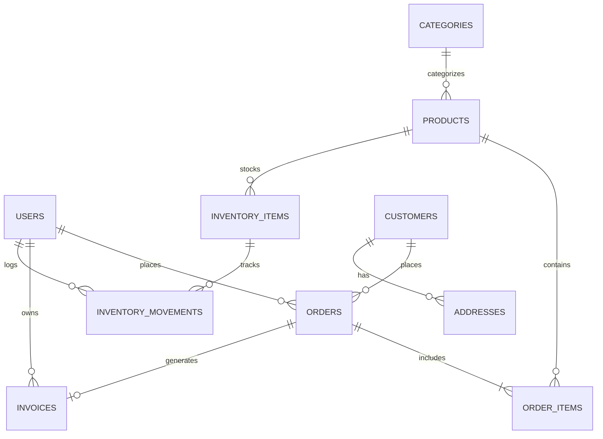
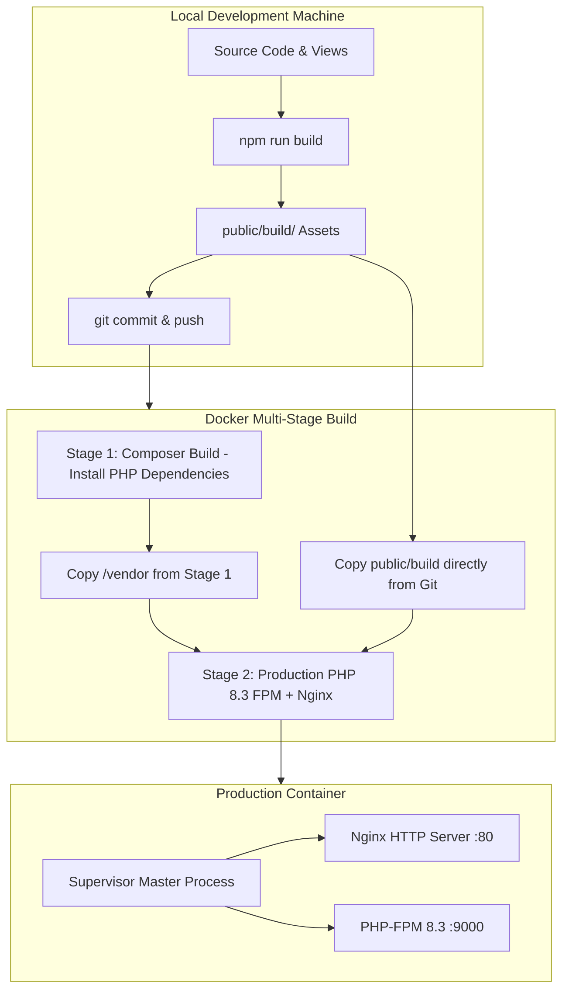

# BLUE ZONE™ — Comprehensive System Architecture & Engineering Report

**Version:** 2.0.0  
**Generated Date:** September 2026  
**Stack:** Laravel 11/12 (PHP 8.3), Filament v3, Vite, Tailwind CSS & Vanilla Design Tokens, Docker & Nginx/PHP-FPM

---

## 1. Executive Summary & Overview

**BLUE ZONE™** is an enterprise-grade longevity and cellular wellness e-commerce platform and administrative ecosystem. The platform unifies a high-performance customer-facing storefront, an advanced client-side state engine, and a comprehensive Filament v3 administrative control center for real-time inventory management, multi-channel sales, invoicing, and dynamic layout customization.

### Key Architectural Highlights
- **Zero-Node Production Docker Architecture**: Frontend assets (`public/build`) are pre-compiled locally via Vite and bundled directly into a hardened Alpine Linux container running PHP-FPM 8.3 + Nginx managed by Supervisor.
- **Bi-Directional E-Commerce Flow**: Complete customer lifecycle (Browsing, Quiz Protocol Recommender, Real-time Cart, Checkout, Account Dashboard, Order Invoices) seamlessly integrated with back-office operations (Offline POS sales, Stock Movements, Invoicing, Role-based Access Control).
- **Hardened Reverse-Proxy & HTTPS Compliance**: Built-in `TrustProxies` and automatic SSL scheme upgrades preventing mixed-content warnings across edge proxies (Cloudflare, Coolify, Traefik, AWS ALB).

---

## 2. Technology Stack & Infrastructure

| Layer | Technology / Tool | Purpose |
|---|---|---|
| **Backend Framework** | Laravel 11.x / 12.x | Core MVC, REST APIs, Eloquent ORM, Authentication, Middleware |
| **PHP Runtime** | PHP 8.3 (Alpine) | High-efficiency execution with OPcache, GD, Zip, Intl, Bcmath, Exif |
| **Admin Control Panel** | Filament v3 | Rapid, reactive back-office interface with Livewire 3 & Alpine.js |
| **Database** | MySQL / SQLite | Relational schema with foreign keys, soft deletes, and movement tracking |
| **Frontend Assets** | Vite 6+, Tailwind CSS, Vanilla JS | Micro-animations, responsive layout, glassmorphism, client-side store |
| **Containerization** | Docker (Multi-stage) | Lean Composer build stage + Nginx & PHP-FPM production image |
| **Process Management** | Supervisor | Supervises Nginx and PHP-FPM master processes with log routing |

---

## 3. Database Schema & Core Models

The database is structured to support e-commerce, multi-location inventory, offline POS sales, and flexible content management:



### Core Entities:
1. **Users & Customers**:
   - `users`: Administrative staff, managers, inventory clerks with role-based permissions (Spatie / Filament Shield).
   - `customers`: Registered storefront users with addresses, wishlists, and order history.
2. **Catalog & Inventory**:
   - `categories`: Hierarchical grouping for wellness formulations.
   - `products`: SKU, pricing, tax rates, ingredients matrix, dosage guides, stock levels, and flagships.
   - `inventory_items` & `inventory_movements`: Real-time stock audit trail recording incoming stock, outgoing sales, offline POS deductions, and transfers.
3. **Orders & Invoices**:
   - `orders`: Order tracking, status transitions (`pending`, `processing`, `completed`, `cancelled`), shipping data.
   - `order_items`: Line-item breakdown with historical price snapshots.
   - `invoices`: Formal tax invoices with print layouts, discount breakdowns, and payment status.
4. **Content & Settings**:
   - Banners, FAQs, Story/Wellness sections, and Typography system settings.

---

## 4. Administrative Control Center (Filament v3)

The admin suite accessible under `/admin` provides full operations management:

- **Dashboard**: Real-time KPI stats overview (Total Revenue, Active Orders, Low Stock Alerts, Customer Growth).
- **Products Management**: Comprehensive catalog editor with SKU validation, ingredient matrices, tax calculation, multi-image uploads, and soft/force deletion.
- **Inventory & Stock Movements**: Real-time movement log showing user actions, movement reasons (`Purchase`, `Sale`, `Adjustment`, `Loss`), and stock transfers.
- **Offline Sales (POS)**: Interface for direct in-store/manual sales recording, deducting stock immediately and generating customer invoices.
- **Invoices & Printable Templates**: High-resolution, printable tax invoices with company branding, tax breakdown, and QR verification.
- **Typography & Layout Manager**: Live configuration for Arabic/English typography (Cairo, Outfit, Rigter fonts), brand tokens, and theme overrides.
- **Role & Permission Engine**: Granular permissions for admins, inventory managers, and customer support representatives.

---

## 5. Storefront & Client-Side State Engine

The customer storefront is optimized for conversion, cellular health education, and rapid checkout:

### Client-Side Modules:
- **`js/products.js` (`BLUEZONE_PRODUCTS`)**: Global formulation matrix exposing dosages, clinical science, and functional areas.
- **`js/cart.js` (`BLUEZONE_CART`)**: Self-healing cart engine stored in `localStorage` with automated price verification, tiered free-shipping threshold bar ($75+), and coupon system (`LONGEVITY10`, `BLUEZONE20`, `WELCOME15`).
- **`js/wishlist.js` (`BLUEZONE_WISHLIST`)**: Reactive wishlist with sync badges and 1-click transfer to cart.
- **`js/app.js` (`BLUEZONE_APP`)**:
  - **Side-by-Side Product Compare Modal**: Dossier view comparing active ingredients, dosages, and prices.
  - **Longevity Protocol Quiz Modal**: Interactive 3-question diagnostic tool recommending customized 2-bottle synergy stacks with 15% bundle discounts.
  - **Quick Action Mobile Dock**: Persistent bottom navigation for mobile viewports.
  - **Scroll Progress & Top Navigation**: Header glassmorphism with dynamic scroll indicator.

---

## 6. Docker & Production Deployment Architecture

The deployment architecture is optimized for minimal memory footprint and fast builds:



### Key Configuration Files:
- [Dockerfile](file:///c:/laragon/frontend_projects/Blue-Zone-site/Dockerfile): 2-stage build without Node.js or queue overhead.
- [docker/nginx.conf](file:///c:/laragon/frontend_projects/Blue-Zone-site/docker/nginx.conf): Nginx configuration optimized for Laravel routing and security.
- [docker/php-fpm.conf](file:///c:/laragon/frontend_projects/Blue-Zone-site/docker/php-fpm.conf): Dynamic worker pool configuration.
- [docker/supervisord.conf](file:///c:/laragon/frontend_projects/Blue-Zone-site/docker/supervisord.conf): Supervisor supervising only Nginx and PHP-FPM.
- [docker/start.sh](file:///c:/laragon/frontend_projects/Blue-Zone-site/docker/start.sh): Container entrypoint executing `php artisan config:cache`, `route:cache`, and launching Supervisor.

---

## 7. Security & HTTPS Compliance

1. **Proxy Trust**: Configured in `bootstrap/app.php` via `$middleware->trustProxies(at: '*')` to correctly identify incoming SSL headers from reverse proxies.
2. **Force HTTPS Scheme**: Enforced in `app/Providers/AppServiceProvider.php` via `URL::forceScheme('https')` when running in production or behind SSL proxies.
3. **CSP Upgrade Policy**: Injected meta headers instructing browsers to upgrade insecure requests automatically:
   `<meta http-equiv="Content-Security-Policy" content="upgrade-insecure-requests">`
4. **File Protection**: Restrictive Nginx rules blocking access to `.env`, `.git`, and sensitive dotfiles.

---

## 8. Automated Testing & Verification Suite

The repository includes a full automated test suite verifying both business logic and security:

```bash
# Run backend PHPUnit tests
php artisan test

# Test categories covered:
# - AdminCrudAndForceDeleteTest
# - AdminProfileAndAuthTest
# - AdminTablesAndPrintTest
# - CustomerAccountTest
# - InventoryAndOfflineSalesTest
# - ProductCreateAndTaxLogicTest
# - TypographySettingsTest
```

---

## 9. System Summary & Maintenance Guide

| Task | Command |
|---|---|
| **Build Frontend Locally** | `npm run build` |
| **Run Local Dev Server** | `php artisan serve` |
| **Run Vite Dev Watcher** | `npm run dev` |
| **Clear App Caches** | `php artisan optimize:clear` |
| **Run Database Migrations** | `php artisan migrate --force` |
| **Seed Demo Data** | `php artisan db:seed` |
| **Deploy to Production** | `git add . && git commit -m "deploy: update" && git push origin main` |

---
*Report maintained under Blue Zone Engineering Architecture.*
